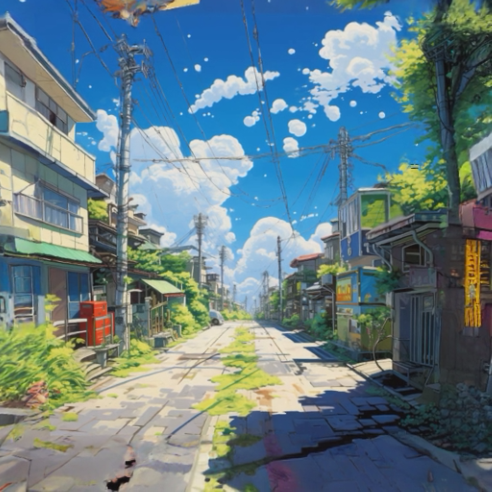
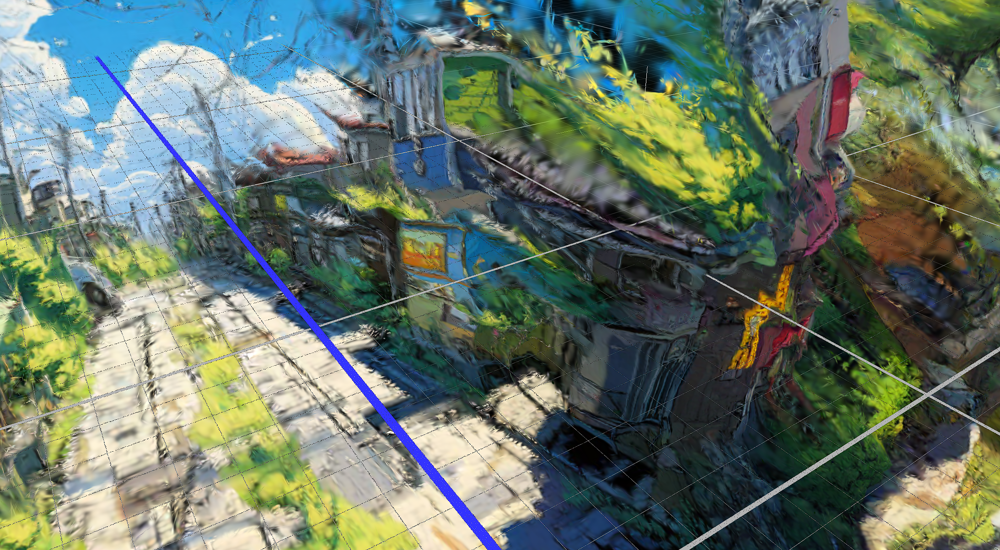
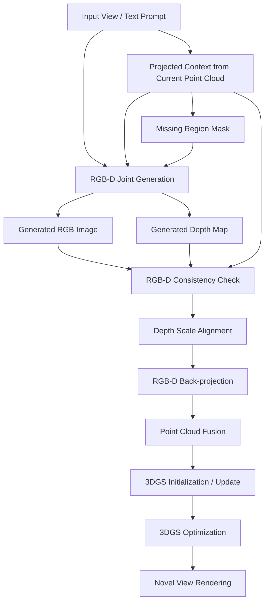
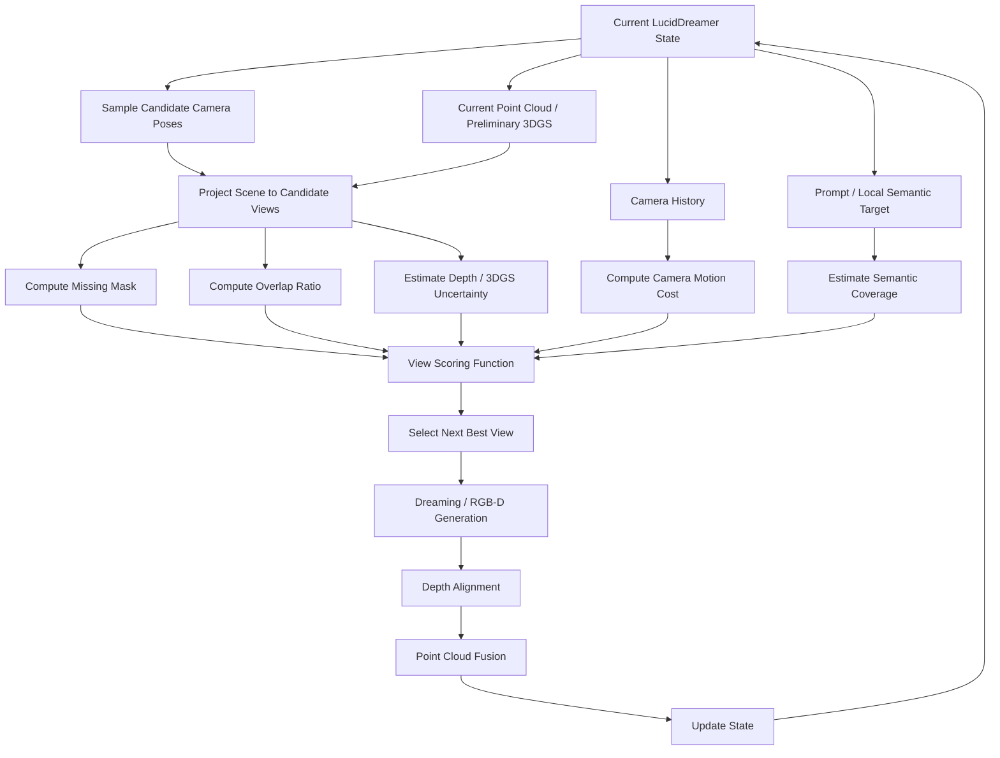

# LucidDreamer Research Portfolio

## Project Overview

本仓库用于记录围绕 LucidDreamer 的复现、问题分析和改进实验，重点关注基于 3D Gaussian Splatting 的文本到 3D 场景生成流程。项目目标不是重新实现完整系统，而是在理解原方法的基础上，探索几何一致性、RGB-D 一致性和相机视角选择等关键问题。当前研究主线包含两部分：RGB-D 联合生成，以及基于 Next-Best-View (NBV) 思路的相机轨迹改进。仓库会持续沉淀阅读笔记、流程图、实验原型和阶段性结论。

## Demo / Running Result

下图展示了本地运行 LucidDreamer 后得到的渲染效果。正面或原始轨迹附近的视角通常具有较好的视觉完整性，说明 LucidDreamer 能够利用扩散补全和 3DGS 优化生成可浏览的三维场景结果。



下图展示了侧面视角下更容易暴露的问题：局部结构可能出现拉伸、漂浮、断裂或深度错位。这类现象说明原流程中的 RGB 生成、深度估计、点云融合和固定相机轨迹之间仍存在几何一致性瓶颈。



## Background: 3DGS and LucidDreamer

3D Gaussian Splatting (3DGS) 是一种显式三维场景表示方法，它用大量带有位置、尺度、旋转、不透明度和颜色/球谐系数的三维高斯来表示场景，并通过可微 splatting 渲染实现高质量、实时的新视角合成。与 NeRF 这类隐式体渲染方法相比，3DGS 通常训练和渲染更快，也更容易把已有点云、相机位姿和多视角观测整合进同一个可优化的场景表示。

LucidDreamer 将 3DGS 用作文本到三维场景生成的最终表示：它先根据文本、RGB 或 RGB-D 输入构建初始点云，再沿相机轨迹不断生成新视角、补全缺失区域、估计并对齐深度，最后用累计得到的点云初始化并优化 3D Gaussian 场景。这个流程的核心优势在于，它可以把二维扩散模型的图像生成能力和 3DGS 的快速可渲染三维表示连接起来。

因此，3DGS 很适合 LucidDreamer 这类 3D 场景生成任务：一方面，它能承接逐步生成过程中不断扩展的点云和多视角图像；另一方面，它能在最终优化阶段缓解部分点云噪声和深度不连续问题，生成可从多视角浏览的三维场景。

## Problem Analysis

LucidDreamer 的流程清晰且工程上可落地，但在开放场景生成中仍存在几个值得重点分析的问题。这些问题也直接对应本仓库后续的两条研究方向。

1. 几何一致性较差。系统依赖单目深度估计、深度尺度对齐和点云融合来构建场景，生成视角之间一旦出现尺度漂移、边界错位或深度断裂，最终 3DGS 虽然可以一定程度上平滑结果，但仍可能出现漂浮结构、空洞、重复物体和多视角不一致。`llff_side.png` 中的侧面视角问题正是这一类现象的直观表现。

2. 固定相机轨迹可能导致部分视角冗余，而部分区域观察不足。原始流程中的相机路径通常来自预设轨迹或手工规则，不能根据当前点云/3DGS 的不确定区域、未覆盖区域或生成失败区域动态调整下一视角。这会造成某些区域被反复观察，而真正缺少几何证据的区域没有被有效补全。

3. RGB 生成结果与深度估计结果可能存在不一致。当前流程通常先生成或补全 RGB 图像，再用独立深度估计模型预测深度；由于二者不是联合建模，物体边界、遮挡关系、局部结构和尺度可能不匹配，进而影响后续 point lifting、深度对齐和 3DGS 优化。

因此，RGB-D 联合生成主要面向第 1、3 类问题，目标是减少颜色与几何之间的错位；相机轨迹改进 / NBV 主要面向第 2 类问题，目标是让系统优先观察最需要补全和修复的区域。

## Direction 1: RGB-D Joint Generation

原始问题是：LucidDreamer 中的 RGB 生成和深度估计通常来自两个相对独立的模块。原始流程可以简化为：

```text
RGB generation / inpainting -> ZoeDepth -> RGB-D lifting -> point cloud fusion -> 3DGS optimization
```

RGB 图像由扩散模型生成或 inpainting 得到，深度图再由单目深度模型估计。当两者在结构边界、遮挡关系或空间尺度上不一致时，系统会把不一致的 RGB-D 观测提升到三维空间，导致点云融合和后续 3DGS 优化出现几何噪声。

一个可能的改进方向是引入 RGB-D 联合生成，让模型在同一条件下同时输出 RGB 图像和对应深度图，或至少在共享条件、共享 latent / denoising 过程、共享几何约束的框架下生成两者。这样可以把“先生成图像、再事后估深度”的串行误差，转化为“颜色与几何共同生成、共同约束”的问题。

### Generation Pipeline



### Experiment Groups

1. **RGB-only / RGB + Estimated Depth / RGB-D Joint 对比**  
   比较只生成 RGB、RGB 后估计 Depth、RGB-D 联合生成三种流程在几何一致性和新视角稳定性上的差异。重点观察 RGB 与 Depth 的边界是否对齐、新视角渲染是否出现几何扭曲、3DGS 初始化点云是否更稳定。

2. **Depth 作为几何约束**  
   将 depth map 用于反投影生成 3D 点、初始化 Gaussian 位置、检查多视角一致性和过滤异常点。目标是评估 depth 约束是否能够减少几何漂移、深度断裂和点云融合错误。

3. **Depth 对视角选择的帮助**  
   如果 RGB-D 联合生成模块能够输出 depth 和 confidence，就可以用这些几何信息判断当前场景哪里不稳定、哪里缺少观察，并进一步引导下一视角选择。这个实验也会连接到 Direction 2 的 NBV 相机轨迹改进。

### Evaluation Metrics

该方向的评价重点包括：RGB-Depth 边界一致性、重叠区域 depth residual、点云漂浮点比例、点云边界断裂情况、3DGS novel view 稳定性，以及侧面视角下的拉伸、破洞和闪烁现象。

## Direction 2: Camera Trajectory Improvement / NBV

原始问题是：LucidDreamer 的相机轨迹通常是固定或预设的，Navigation 步骤不会主动读取当前 3D 状态。因此，相机不知道哪些区域已经被充分观察，哪些区域仍然缺少几何证据，也不知道某个候选视角是否有足够上下文用于 inpainting 和深度对齐。

Navigation 是 LucidDreamer 中最适合改造的位置。因为它决定下一步相机会看到什么、哪些区域会成为 missing mask、扩散模型需要生成什么，以及 Alignment 是否容易把新内容接回已有点云。NBV 思路可以把相机路径从“预设轨迹”改造成“状态驱动的下一视角选择”。

### NBV Pipeline



### View Scoring Function

第一版可以先使用可解释的启发式评分函数：

```text
Score(view) =
  w1 * coverage_gain
  + w2 * generation_friendliness
  + w3 * alignment_reliability
  + w4 * geometry_uncertainty_gain
  + w5 * semantic_coverage
  - w6 * camera_motion_cost
  - w7 * failure_risk
```

其中，`coverage_gain` 衡量该视角能看到多少未覆盖区域；`generation_friendliness` 衡量 missing mask 是否适合扩散模型补全；`alignment_reliability` 衡量候选视角与已有点云是否有足够重叠；`geometry_uncertainty_gain` 可来自 depth residual、depth confidence 或 3DGS 不确定性；`camera_motion_cost` 用于限制相机路径突然跳跃；`failure_risk` 用于惩罚穿模、贴近表面、mask 过大或重叠过少等高风险视角。

### Experiment Design

1. **固定轨迹 vs 启发式 NBV**  
   对比 LucidDreamer 原始固定轨迹、随机候选视角、只按 missing mask 面积选择的 coverage-only NBV，以及综合 mask、overlap、depth residual、movement cost 的启发式 NBV。

2. **两阶段轨迹策略**  
   第一阶段使用预设轨迹或全局轨迹先验进行 layout expansion，快速建立场景主体；第二阶段使用 NBV 进行 completion / repair，重点修补空洞、深度断裂、漂浮结构和侧面质量问题。

3. **视角评分函数消融**  
   分别去掉生成友好度、对齐可靠性、未覆盖区域收益、移动成本和风险过滤，观察各项指标对 Dreaming 成功率、depth alignment、点云异常点和 novel view 稳定性的影响。

4. **Director3D 轨迹先验 + NBV 重排**  
   使用文本条件轨迹先验提供全局候选路径，再用 NBV scorer 根据当前 LucidDreamer 状态重排和选择下一视角。目标是让路径既符合 prompt 场景类型，又能动态修复当前几何问题。

## Current Progress

当前仓库已经完成基础研究资料整理，包括 README、核心论文列表、LucidDreamer 方法总结、RGB-D 联合生成计划、相机轨迹改进 / NBV 计划，以及本地运行结果资源整理。`docs/02_luciddreamer_summary.md` 记录了 LucidDreamer 的基本流程和问题分析，`docs/04_rgbd_joint_generation_plan.md` 与 `docs/05_camera_trajectory_improvement_plan.md` 分别展开了两条主要研究方向。

## Future Work

下一步工作将优先实现两个轻量原型：`experiments/camera_path_visualization/` 用于可视化原始轨迹、候选轨迹和选中轨迹；`experiments/view_scoring_prototype/` 用于实现候选视角评分函数并分析各项指标。同时，将进一步验证 RGB-D joint 方案是否能改善 RGB 与 Depth 边界一致性、点云稳定性和 3DGS novel view 质量，并探索 depth uncertainty 与 NBV 视角选择的结合方式。
