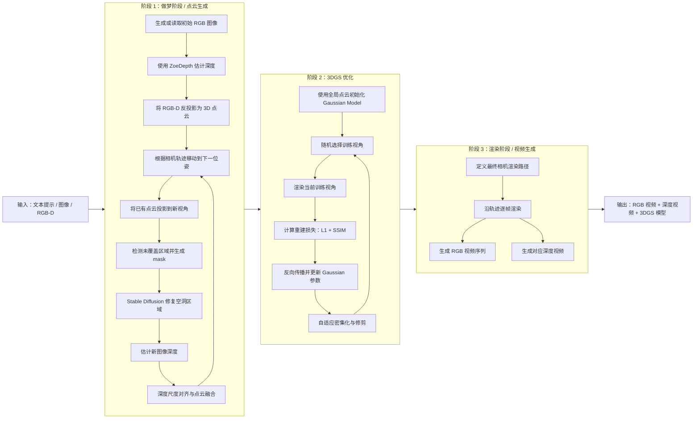
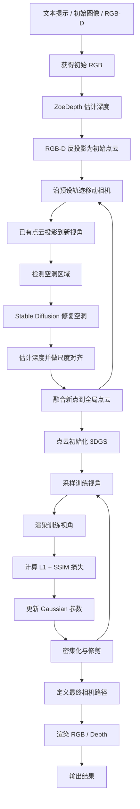
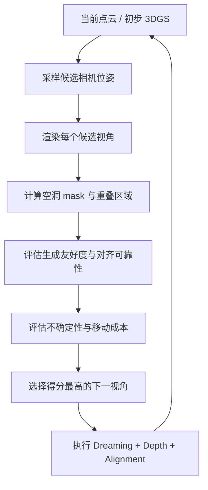

# LucidDreamer 方法总结与问题分析

## 1. LucidDreamer 的目标

LucidDreamer 是一个面向开放域三维场景生成的框架，目标是从稀疏输入生成可渲染、可浏览的高质量 3D 场景。它不是直接训练一个端到端 3D 生成模型，而是把二维扩散模型的图像补全能力、单目深度估计能力和 3D Gaussian Splatting 的快速渲染能力组合起来，通过逐步扩展视角的方式构建完整场景。

更具体地说，LucidDreamer 的核心思想是：先从初始 RGB-D 观测得到一个局部点云，然后沿预设相机轨迹移动相机，把已有点云投影到新视角，在空洞区域使用扩散模型进行 inpainting，再估计新图像的深度并对齐到全局点云。经过多轮迭代后，系统得到一个较完整的点云，并用它初始化和训练 3DGS 模型，最终输出新视角视频、深度视频和高斯场景表示。

### 技术栈

- **Stable Diffusion**：用于生成初始图像或对新视角中的未覆盖区域进行图像修复。
- **ZoeDepth**：用于从 RGB 图像估计深度图。
- **3D Gaussian Splatting (3DGS)**：用于最终场景表示、训练和实时渲染。
- **ControlNet / LaMa**：可作为辅助模块，用于增强图像生成、补全或局部修复效果。

### 核心创新

LucidDreamer 的创新点可以概括为“把生成和重建放进同一个迭代过程”。每一步相机移动都会暴露新的未覆盖区域，系统再用扩散模型“做梦”出这部分内容，并用深度估计和几何对齐把新内容接回三维空间。这个过程使二维生成模型不只生成单张图像，而是逐步参与到三维场景的扩展与优化中。

## 2. 输入输出

### 输入

LucidDreamer 支持多种形式的输入，常见输入包括：

- 文本提示词；
- 单张或少量 RGB 图像；
- RGB-D 图像；
- 可选的相机参数或预设相机轨迹。

从论文描述看，文本输入可以先生成初始 RGB 图像，再估计深度并进入三维扩展流程；从本地运行和代码使用角度看，更直接、稳定的入口通常是图像或 RGB-D 输入。

### 输出

系统最终可以输出：

- 生成视角对应的 RGB 视频；
- 对应的深度视频；
- 迭代构建得到的全局点云；
- 训练后的 3D Gaussian Splatting 模型；
- 沿指定相机路径渲染的新视角结果。

## 3. 基本 Pipeline

LucidDreamer 的整体流程可以分成三个阶段：点云生成、3DGS 训练和最终渲染。

### 3.1 完整版 Pipeline



### 3.2 简洁版 Pipeline



### 3.3 关键步骤说明

**初始化阶段**

- 如果输入是文本，理论流程会先生成与文本对应的初始 RGB 图像；如果输入是 RGB 图像，则直接使用该图像作为初始视角。
- 对初始 RGB 图像使用 ZoeDepth 估计深度，得到初始 RGB-D。
- 根据相机内参和深度图，将 RGB-D 反投影到世界坐标系，形成初始点云。

**迭代扩充阶段**

- 系统根据预设相机轨迹移动相机，例如向前、环绕、俯视或旋转。
- 将已有点云投影到新相机视角，得到已知区域、深度图和未覆盖 mask。
- 对新视角中的空洞区域使用 Stable Diffusion 进行修复；非空洞区域主要来自已有点云投影和颜色插值。
- 对修复后的新 RGB 图像再次使用 ZoeDepth 估计深度。
- 在新旧视角的重叠区域进行深度尺度对齐，使新生成深度能够接入已有三维结构。
- 将新 RGB-D 反投影到世界坐标系，并与全局点云融合。

**3DGS 训练阶段**

- 将迭代生成的全局点云作为 3DGS 的初始化点。
- 将每一步生成或重投影得到的视角图像作为训练监督。
- 通过 L1、SSIM 等重建损失优化 Gaussian 的位置、尺度、旋转、不透明度和颜色参数。
- 通过密集化与修剪机制补充高误差区域、删除低贡献 Gaussian。

**渲染阶段**

- 使用预设的相机路径和相机参数渲染最终结果。
- 同时输出 RGB 视频、深度视频和训练后的高斯模型。

## 4. 3DGS 在其中的作用

3DGS 在 LucidDreamer 中不是初始生成模块，而是最终三维表示和渲染模块。它的作用主要有三点。

第一，3DGS 承接点云生成阶段的结果。LucidDreamer 前半部分不断生成新视角并融合点云，但点云本身通常比较稀疏、噪声较多，并且不同视角之间可能存在深度错位。3DGS 可以以这个点云作为初始化，在后续优化中学习更连续、更适合渲染的场景表示。

第二，3DGS 提供高效的新视角渲染能力。相比直接使用点云渲染，3D Gaussian 的连续体积表达可以减少孔洞和离散点带来的视觉断裂，也能更快地渲染视频序列。

第三，3DGS 可以在一定程度上缓解点云融合误差。虽然它不能彻底解决前面阶段产生的几何不一致，但通过优化 Gaussian 参数、密集化和修剪，它可以对局部噪声、稀疏区域和边界不连续进行一定补偿。

因此，LucidDreamer 的整体逻辑可以理解为：前半段负责“生成足够多的三维证据”，后半段用 3DGS 把这些证据优化成可渲染的三维场景。

## 5. 本地部署运行结果展示

### RGB 渲染结果

<video controls src="../assets/luciddreamer_result/llff.mp4" width="720"></video>

### Depth 渲染结果

<video controls src="../assets/luciddreamer_result/depth_llff.mp4" width="720"></video>

### 侧面视角问题示例


从本地结果看，正面或原轨迹附近的视角通常较自然，但侧面视角更容易暴露几何问题：局部结构可能拉伸、断裂或漂浮，说明点云扩展阶段的深度估计和多视角对齐仍然不够稳定。

## 6. 可能存在的问题

### 6.1 几何一致性较差

LucidDreamer 依赖单目深度估计来把二维生成结果提升到三维空间。但单目深度本身并不保证跨视角尺度一致，尤其在扩散模型生成了新物体、新纹理或大面积背景时，ZoeDepth 估计出的局部深度可能与已有点云不匹配。

这种不一致会在后续流程中被放大：

- 新旧点云边界处可能出现断裂；
- 不同视角生成的同一物体可能尺度不同；
- 远处背景和近处物体的相对深度可能不稳定；
- 3DGS 优化后仍可能保留漂浮点、拉伸面或重复结构。

### 6.2 相机轨迹是固定的、预设的

LucidDreamer 的 Navigation 步骤通常沿预设 camera path 前进。这种方式实现简单，也能保证生成过程可控，但它没有读取当前三维状态，因此不知道哪里已经被充分观察、哪里仍然缺少几何证据。

固定轨迹可能带来两个问题：

- 视角冗余：相机反复观察已经较完整的区域，生成收益有限。
- 观察不足：侧面、背面、转角或远处区域没有被有效观察，导致点云和 3DGS 在这些位置质量较差。

### 6.3 RGB 与 Depth 来自不同模块

当前流程通常是先用 Stable Diffusion 生成或补全 RGB，再用 ZoeDepth 估计深度。RGB 生成模型追求图像合理性，深度估计模型追求单图几何解释，二者没有被联合约束。

这会导致一个核心矛盾：RGB 看起来可能合理，但对应深度不一定能支持稳定的三维融合。特别是在物体边界、遮挡关系、复杂家具、细长结构和大面积补全区域，RGB 与 Depth 的不一致会直接影响点云质量。

### 6.4 扩散补全容易产生语义漂移

新视角空洞区域由扩散模型补全。如果 mask 面积过大、上下文不足或视角变化过猛，扩散模型可能生成与原场景不一致的内容，例如重复物体、错误纹理或不符合空间布局的新结构。后续深度估计会把这些内容强行提升到三维空间，从而造成更难修复的结构错误。

## 7. 相机轨迹 / 视角生成在其中的位置

LucidDreamer 最适合改造的位置是 **Navigation**。因为 Navigation 决定下一步相机会看到什么，也决定 Dreaming 阶段需要补全什么区域，以及 Alignment 阶段是否容易把新内容接回已有点云。

### 7.1 RGB-D 联合生成方向

RGB-D 联合生成主要用于解决 RGB 与 Depth 分离导致的几何不一致问题。理想情况下，模型不再先生成 RGB、再单独估计 Depth，而是在同一个生成框架下同时预测颜色和深度，或者至少让二者共享条件和几何约束。

这个方向可以重点比较：

- RGB 边界与 Depth 边界是否更一致；
- 新旧点云融合处的断裂是否减少；
- 侧面视角下的漂浮和拉伸结构是否改善；
- 3DGS 训练后的新视角渲染是否更稳定。

### 7.2 新视角生成 / NBV 方向

新视角生成主要用于解决固定相机轨迹的问题。相比沿预设路径机械移动，相机可以根据当前状态动态选择下一视角。

一个更合理的下一视角应该同时满足：

- 能看到足够多的未覆盖区域；
- 与已有点云有足够重叠，便于深度尺度对齐；
- mask 形状适合扩散模型补全，不能过碎或过大；
- 能观察当前点云或 3DGS 中低置信、不稳定的区域；
- 相机移动距离和角度不能过大，避免生成过程突然漂移；
- 与文本 prompt 中尚未充分出现的语义区域相关。

可以先从启发式 NBV 原型开始：



评分函数可以写成：

```text
Score(view) =
  未覆盖区域收益
  + 几何不确定性收益
  + mask 生成友好度
  + 语义覆盖收益
  - 移动成本
  - 对齐风险
```

这个方向的关键不是让相机路径“更好看”，而是让相机路径服务于三件事：扩散模型更容易补全、深度更容易对齐、最终 3DGS 更稳定。

## 8. 小结

LucidDreamer 的价值在于，它把二维扩散模型、深度估计和 3DGS 串成了一个可运行的文本/图像到 3D 场景生成流程。它的问题也来自这个组合式结构：RGB、Depth、点云融合和 3DGS 优化之间并不是端到端一致的，因此容易出现几何不连续、深度错位和视角覆盖不足。

后续研究可以围绕两条主线推进：

1. **RGB-D 联合生成**：减少 RGB 与 Depth 分离带来的结构不一致。
2. **相机轨迹改进 / NBV**：让 Navigation 从固定路径变成状态驱动的下一视角选择。

这两条方向分别对应 LucidDreamer 的两个关键瓶颈：一个是“生成出来的内容是否几何可信”，另一个是“相机是否看到了最该看的地方”。
