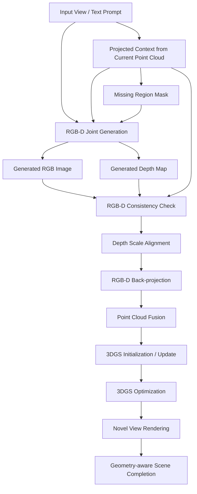

# RGB-D Joint Generation 实验计划

## 1. 采用 RGB-D 联合生成的原因

LucidDreamer 当前流程中，RGB 图像生成和 Depth 估计通常由两个相对独立的模块完成：先使用 Stable Diffusion / inpainting 得到 RGB，再使用 ZoeDepth 估计对应深度。这个串行流程实现简单，但也带来一个关键问题：RGB 结果和 Depth 结果之间没有被联合约束。

对 3D 场景生成来说，RGB 图像看起来合理并不等于它能被稳定提升到三维空间。如果深度图与 RGB 图像在物体边界、遮挡关系、远近尺度或局部结构上不一致，那么后续反投影、点云融合和 3DGS 初始化都会受到影响。特别是在 LucidDreamer 的迭代扩展过程中，每一步的 RGB-D 误差都会被写入全局点云，之后再影响下一视角投影和 inpainting。

因此，引入 RGB-D 联合生成的核心目的不是单纯获得“更好看的深度图”，而是让颜色生成和几何生成在同一条件下协同发生，从源头减少 RGB 与 Depth 的错位。

### 1.1 原始流程中的问题

原始流程可以简化为：

```text
Prompt / Input View
    -> RGB generation / RGB inpainting
    -> monocular depth estimation
    -> RGB-D back-projection
    -> point cloud fusion
    -> 3DGS initialization and optimization
```

其中潜在问题包括：

- **边界不一致**：RGB 中的物体边界和 Depth 中的深度边界可能不重合。
- **尺度不稳定**：单目深度估计只依赖当前图像，跨视角尺度可能漂移。
- **遮挡关系错误**：RGB 中看起来在前景的物体，Depth 中可能被估到错误距离。
- **局部结构变形**：细长物体、桌椅边缘、墙角、窗框等区域容易出现深度断裂。
- **误差累积**：每一步生成的 RGB-D 都会被融合进点云，错误会进入后续迭代。

### 1.2 RGB-D 联合生成的目标

RGB-D 联合生成希望将流程改为：

```text
Prompt / Input View / Projected Context
    -> joint RGB-D generation
    -> RGB-D consistency check
    -> point cloud fusion
    -> 3DGS initialization and optimization
```

它的目标包括：

- 让 RGB 边界和 Depth 边界更一致；
- 让补全区域的颜色、结构和深度同时生成；
- 减少新旧点云融合时的深度断裂；
- 提高 3DGS 初始化点云的稳定性；
- 降低侧面视角中的漂浮、拉伸和破碎结构。

## 2. RGB-D 联合生成流程

### 2.1 总体流程



### 2.2 接入 LucidDreamer 的位置

在 LucidDreamer 中，RGB-D 联合生成最适合替换或增强 **Dreaming + Depth Estimation** 两个步骤。

原始版本：

```text
Projected RGB + missing mask
    -> Stable Diffusion inpainting
    -> generated RGB
    -> ZoeDepth
    -> estimated depth
```

改进版本：

```text
Projected RGB + projected depth + missing mask + prompt
    -> RGB-D joint generator
    -> generated RGB + generated depth
    -> consistency check and scale alignment
```

也就是说，联合生成模块不仅看 prompt 和 RGB 上下文，还应尽量使用当前点云投影得到的 depth context。这样模型生成的新深度不会完全脱离已有三维结构。

### 2.3 模块输入与输出

**输入**

- 当前视角下的投影 RGB；
- 当前视角下的投影 Depth；
- missing mask；
- 文本 prompt 或局部 prompt；
- 相机内参和当前相机位姿；
- 可选的历史视角或邻近视角约束。

**输出**

- 完整 RGB 图像；
- 完整 Depth map；
- 可选的 confidence map；
- 可选的 invalid / uncertain mask。

### 2.4 一致性检查

联合生成后仍然需要检查 RGB 与 Depth 是否可信，不能直接全部写入点云。可以设计几类检查：

- **边界一致性**：RGB 边缘和 depth discontinuity 是否对齐。
- **深度尺度一致性**：与已有投影 depth 的重叠区域是否尺度相近。
- **局部平滑性**：平面区域深度是否连续，边界区域是否允许突变。
- **多视角一致性**：生成区域从邻近视角重投影后是否稳定。
- **异常值过滤**：删除过近、过远、孤立或明显漂浮的点。

## 3. 实验计划

## 实验 1：RGB-only / RGB + Estimated Depth / RGB-D Joint 对比

### 实验目标

比较三种生成流程在几何一致性、新视角稳定性和 3DGS 初始化质量上的差异。

### 实验组设置

| 组别 | 流程 | 目的 |
| --- | --- | --- |
| A. RGB-only | 只生成 RGB，不使用生成深度参与三维融合 | 作为视觉生成基线，观察只看 RGB 时的上限和缺陷 |
| B. RGB + Estimated Depth | RGB 由扩散模型生成，Depth 由 ZoeDepth 后估计 | 对应 LucidDreamer 原始思路 |
| C. RGB-D Joint | RGB 与 Depth 由联合生成或共享条件模型同时得到 | 验证联合建模是否改善几何一致性 |

### 控制变量

- 使用相同 prompt；
- 使用相同初始图像或初始 RGB-D；
- 使用相同相机轨迹；
- 使用相同 3DGS 训练参数；
- 使用相同生成步数和随机种子，若模型支持。

### 观察指标

1. RGB 与 Depth 的边界是否对齐。
2. 新视角渲染是否出现明显几何扭曲。
3. 3DGS 初始化点云是否更稳定、更少漂浮点。
4. 场景补全过程中是否减少破碎结构、深度突变和重复物体。
5. 侧面视角和大角度 novel view 是否更自然。

### 预期结论

如果 RGB-D 联合生成有效，那么 C 组应该在几何边界、点云连续性和侧面视角稳定性上优于 B 组。A 组可能在单张图像视觉质量上较好，但缺少可靠几何，不能作为完整三维生成方案。

## 实验 2：Depth 作为几何约束

### 实验目标

将 depth map 作为场景扩展过程中的几何先验，评估它是否能够减少几何漂移、深度断裂和点云融合错误。

### Depth Map 的作用

Depth map 在 LucidDreamer 改进流程中可以承担四类作用：

1. **反投影生成 3D 点**：将新生成像素提升到三维空间，扩展全局点云。
2. **初始化 Gaussian 位置**：为后续 3DGS 提供更稳定的初始空间分布。
3. **检查多视角一致性**：把新生成深度重投影到已有视角，判断是否与已有几何冲突。
4. **引导视角选择**：利用深度不确定区域、深度断裂区域或低覆盖区域，帮助选择下一视角。

### 实验组设置

| 组别 | Depth 使用方式 | 说明 |
| --- | --- | --- |
| A. No Depth Constraint | depth 只用于最终反投影 | 最弱约束 |
| B. Alignment-only | depth 用于尺度对齐和点云融合 | 接近原始流程 |
| C. Consistency-aware | depth 同时用于边界检查、多视角检查和异常点过滤 | 加入几何一致性约束 |
| D. Geometry-guided Generation | projected depth 作为联合生成条件输入 | 让生成阶段提前感知几何 |

### 评价指标

- 重叠区域 depth residual；
- 点云中孤立点或漂浮点比例；
- 新旧点云边界处的深度跳变；
- 3DGS 训练后的 pruning 比例；
- novel view 中的几何拉伸、破洞和闪烁现象。

### 预期结论

如果 depth 约束有效，那么 C / D 组应当比 A / B 组具有更低的 depth residual 和更少的漂浮点。D 组如果表现更好，说明把 depth 作为生成条件提前注入，比生成后再纠错更有价值。

## 实验 3：Depth 对视角选择的帮助

### 实验目标

验证 depth 信息是否能帮助 LucidDreamer 更合理地选择下一视角。这个实验连接 RGB-D 联合生成方向和 NBV 相机轨迹改进方向。

### 基本思路

如果联合生成模块能够输出 depth 和 confidence，那么系统可以用这些几何信息判断当前场景哪里不稳定、哪里缺少观察、哪里容易在侧面视角暴露问题。下一视角不再只沿固定路径前进，而是优先观察几何不确定区域。

### 候选视角评分

可以先设计一个启发式评分函数：

```text
Score(view) =
  w1 * visible_uncertain_depth_area
  + w2 * missing_region_area
  + w3 * overlap_with_existing_geometry
  - w4 * depth_alignment_risk
  - w5 * camera_motion_cost
```

其中：

- `visible_uncertain_depth_area`：候选视角能看到多少深度不确定区域；
- `missing_region_area`：候选视角下有多少未覆盖区域；
- `overlap_with_existing_geometry`：候选视角与已有几何的重叠比例；
- `depth_alignment_risk`：深度尺度难以对齐、视角太斜或相机太近的风险；
- `camera_motion_cost`：相机移动距离和旋转角度。

### 实验组设置

| 组别 | 视角策略 | 说明 |
| --- | --- | --- |
| A. Fixed Path | 使用原始预设相机轨迹 | baseline |
| B. Mask-only View Selection | 只根据空洞区域面积选择视角 | 验证 coverage 的作用 |
| C. Depth-aware View Selection | 加入 depth uncertainty 和 depth residual | 验证 depth 对视角选择的帮助 |
| D. RGB-D + Depth-aware View Selection | 联合生成 RGB-D，并用 depth 引导下一视角 | 完整改进版本 |

### 评价指标

- 相同生成步数下的场景覆盖率；
- 低置信 depth 区域是否减少；
- 侧面 / 背面 novel view 的几何稳定性；
- 3DGS 渲染中的漂浮结构和空洞数量；
- 每一步 inpainting mask 是否更适合生成；
- 相机轨迹是否出现过大跳跃或不自然移动。

### 预期结论

如果 depth 对视角选择有帮助，C / D 组应当比固定轨迹更少观察冗余区域，并更快修复几何不稳定区域。D 组是最终目标：RGB-D 联合生成负责提供更可信的几何，depth-aware 视角选择负责决定下一步看哪里。

## 4. 实验评价方式

### 4.1 定性评价

重点观察以下可视化结果：

- RGB 与 depth 边界叠加图；
- 点云侧面视角；
- 3DGS novel view 渲染视频；
- depth video 中的突变和闪烁；
- inpainting mask 与生成结果对比。

### 4.2 定量评价

如果没有真实 3D ground truth，可以优先使用无监督或弱监督指标：

| 指标 | 含义 |
| --- | --- |
| Depth edge alignment | RGB 边缘与深度边缘的一致程度 |
| Overlap depth residual | 新旧视角重叠区域的深度残差 |
| Reprojection error | 邻近视角之间的重投影误差 |
| Floating point ratio | 点云中孤立点或异常点比例 |
| Hole ratio | 渲染视角中的空洞比例 |
| Multi-view flicker | 连续视角渲染中的闪烁程度 |
| 3DGS pruning ratio | 训练中被修剪 Gaussian 的比例 |

如果有可用的 synthetic scene 或保留视角，也可以增加 PSNR、SSIM、LPIPS 等标准 novel view synthesis 指标。

## 5. 实施路线

### 阶段 0：建立 Baseline

- 跑通原始 LucidDreamer 流程；
- 保存每一步 RGB、Depth、mask、camera pose 和 point cloud；
- 记录原始流程中的典型失败案例。

### 阶段 1：离线 RGB-D 联合生成验证

- 先不改 LucidDreamer 主流程；
- 对同一批 prompt / input view 生成 RGB-D；
- 比较 ZoeDepth 后估计 depth 与 joint depth 的边界一致性和深度稳定性。

### 阶段 2：替换 Dreaming + Depth Estimation

- 将联合生成模块接入每一步新视角补全；
- 输出 RGB、Depth、confidence；
- 加入 depth scale alignment 和异常点过滤。

### 阶段 3：接入 3DGS 训练

- 用联合生成得到的 RGB-D 构建点云；
- 对比原始点云初始化和联合生成点云初始化；
- 观察最终 3DGS novel view 质量。

### 阶段 4：引入 Depth-aware View Selection

- 用 depth uncertainty 和 missing mask 共同评分候选视角；
- 对比固定轨迹与 depth-aware 轨迹；
- 评估在相同生成步数下的覆盖率和几何稳定性。

## 6. 可能风险

1. **联合生成模型本身不稳定**：RGB-D 联合结果可能牺牲 RGB 视觉质量，或 depth 仍然不可靠。
2. **深度尺度仍需对齐**：即使联合生成 RGB-D，不同视角之间的绝对尺度仍可能存在漂移。
3. **计算成本增加**：联合生成、consistency check 和多视角验证都会增加推理时间。
4. **评价缺少 ground truth**：开放域生成场景通常没有真实三维参考，需要设计弱监督指标。
5. **错误 depth 会误导视角选择**：如果 depth uncertainty 估计不准，NBV 模块可能优先观察错误区域。

## 7. 参考论文

1. **JointDiT: Enhancing RGB-Depth Joint Modeling with Diffusion Transformers**  
   可作为 RGB-Depth 联合建模的主要参考，重点关注 RGB 与 Depth 在同一扩散框架中的协同生成。

2. **JointNet: Extending Text-to-Image Diffusion for Dense Distribution Modeling**  
   可作为从 text-to-image 扩展到稠密预测任务的参考，适合思考如何让扩散模型同时输出图像和 dense map。

3. **Scalable Diffusion Models with Transformers**  
   可作为 Diffusion Transformer 架构参考，帮助理解 JointDiT 一类方法的模型基础。

4. **LucidDreamer: Domain-free Generation of 3D Gaussian Splatting Scenes**  
   本实验计划的目标系统，RGB-D 联合生成主要替换其 Dreaming + Depth Estimation 环节。

5. **3D Gaussian Splatting for Real-Time Radiance Field Rendering**  
   作为最终三维表示与渲染模块的基础方法。

## 8. 小结

RGB-D 联合生成的核心价值在于把 LucidDreamer 中“先生成 RGB、再估计 Depth”的串行流程，改造成颜色与几何共同生成、共同检查、共同进入三维融合的流程。它直接对应 LucidDreamer 当前最明显的几何一致性问题。

从实验推进角度看，建议先做最小闭环：比较原始 RGB + ZoeDepth 与 RGB-D joint 的边界一致性、点云稳定性和侧面视角渲染质量；如果这个方向成立，再继续把 depth uncertainty 用于下一视角选择，与 NBV 改进方向连接起来。
