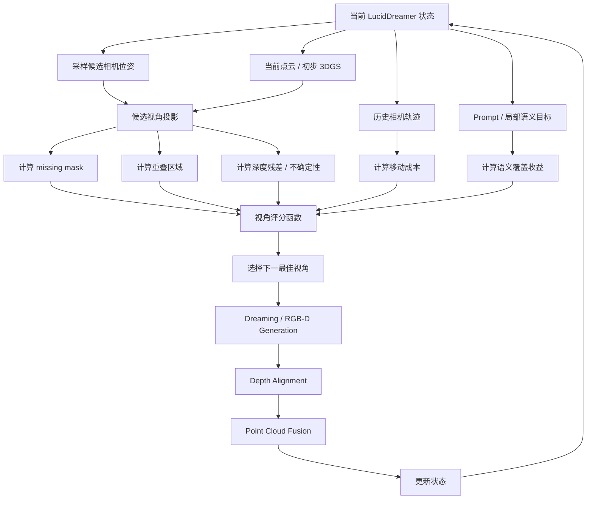

# Camera Trajectory Improvement / NBV 实验计划

## 1. 改进相机轨迹的原因

LucidDreamer 的场景生成过程高度依赖相机轨迹。每一次相机移动都会决定下一步看到什么区域、哪些区域会成为 inpainting mask、生成的新内容是否有足够上下文，以及新生成 RGB-D 是否容易与已有点云对齐。因此，相机轨迹不是单纯的渲染路径，而是整个三维生成流程中的控制变量。

原始 LucidDreamer 通常使用预设 camera path，例如环绕、前进、俯视或旋转。这种方式简单稳定，但它不会根据当前三维状态动态调整下一视角。也就是说，相机不知道哪些区域已经被充分观察，哪些区域仍然缺少几何证据，也不知道某个新视角下的 mask 是否适合扩散模型补全。

因此，本方向的核心目标是：把 LucidDreamer 的 Navigation 从固定路径改造成状态驱动的下一视角选择，使相机轨迹同时服务于场景扩展、几何对齐和最终 3DGS 稳定性。

### 1.1 固定相机轨迹的问题

固定轨迹可能带来以下问题：

- **视角冗余**：相机反复观察已经较完整的区域，新增信息有限。
- **观察不足**：侧面、背面、转角、遮挡后方或远处背景没有被充分生成。
- **mask 不适合生成**：某些视角下空洞过大、过碎或缺少上下文，导致 inpainting 结果不稳定。
- **深度对齐困难**：新视角与已有点云重叠太少，深度尺度难以可靠估计。
- **几何错误累积**：相机继续沿预设路径前进时，无法主动回看和修复前面生成出的低质量区域。

### 1.2 引入 NBV 的目标

Next-Best-View (NBV) 的基本思想是：不要机械地执行下一段预设轨迹，而是在每一步根据当前三维状态选择最有价值的下一视角。

在 LucidDreamer 中，一个好的下一视角应当满足：

- 能看到足够大的未覆盖区域；
- 与已有点云 / 3DGS 有足够重叠，便于深度对齐；
- 生成 mask 大小适中、形状连通、上下文充分；
- 能观察低置信、低可见性或几何不稳定区域；
- 相机移动距离和旋转角度不过大；
- 能服务于 prompt 中尚未充分生成的语义内容；
- 不容易导致相机穿模、贴近表面或看向无意义区域。

## 2. 总体改进思路

### 2.1 从固定路径到状态驱动路径

原始流程：

```text
current camera
    -> take next pose from preset camera path
    -> project point cloud
    -> inpaint missing region
    -> estimate depth and align
    -> update point cloud
```

改进流程：

```text
current LucidDreamer state
    -> sample candidate camera poses
    -> render / project current point cloud to each candidate
    -> compute view score
    -> select next-best-view
    -> inpaint missing region
    -> estimate depth and align
    -> update point cloud and state
```

关键变化在于：相机位姿不再只由预设路径决定，而是由当前点云、mask、depth residual、历史相机和 3DGS 不确定性共同决定。

### 2.2 总体流程图



## 3. 候选视角生成

候选视角生成决定了 NBV 能探索哪些可能路径。第一阶段不建议直接训练连续 pose generator，而是先用启发式候选采样跑通闭环。

### 3.1 候选来源

候选视角可以来自以下几类：

1. **预设轨迹附近扰动**  
   在原始 `lookaround`、`lookdown`、`rotate360` 等轨迹点附近做小范围平移和旋转扰动。这样可以保持原流程稳定性，同时允许局部修正。

2. **当前相机局部增量**  
   从当前位姿向前、向左、向右、向上、向下以及 yaw / pitch 方向采样局部增量，适合做在线 NBV。

3. **空洞区域导向采样**  
   根据当前投影 mask 或点云低覆盖区域，采样能看到这些区域的相机位姿。

4. **低置信区域导向采样**  
   如果已有初步 3DGS 或 depth confidence，可以围绕低 opacity、低覆盖次数、深度残差大的区域采样候选视角。

5. **文本轨迹先验**  
   借鉴 Director3D 思路，用 prompt 给出全局轨迹方向，例如室内环视、走廊前进、物体环绕或景观推进，再由 NBV scorer 做局部选择。

### 3.2 候选过滤

候选视角在评分前应先过滤明显不可用的位姿：

- 相机距离已有几何太近；
- 相机位于点云内部或穿过表面；
- 有效投影区域太少；
- 与已有视角重叠太低，无法做深度尺度对齐；
- missing mask 过大，几乎没有上下文；
- 相机移动或旋转过大，容易造成生成漂移。

## 4. 视角评分函数

### 4.1 基本评分函数

可以先使用可解释的启发式评分函数：

```text
Score(view) =
  w1 * U_vis
  + w2 * M_gen
  + w3 * O_align
  + w4 * I_gs
  + w5 * A_sem
  - w6 * C_move
  - w7 * R_risk
```

其中：

- `U_vis`：可见性收益，即该视角能看到多少未覆盖或低覆盖区域。
- `M_gen`：生成友好度，即 missing mask 是否适合扩散模型补全。
- `O_align`：对齐可靠性，即新视角与已有点云是否有足够重叠。
- `I_gs`：3DGS 信息增益，即该视角是否能降低 Gaussian 不确定性。
- `A_sem`：语义覆盖收益，即该视角是否能补足 prompt 中尚未出现的内容。
- `C_move`：移动成本，包括平移距离和旋转角度。
- `R_risk`：风险项，包括穿模、贴近表面、mask 过碎、深度尺度不稳定等。

### 4.2 各项指标设计

**可见性收益 `U_vis`**

衡量候选视角能看到多少未覆盖或低置信区域。可以用 missing mask 面积、体素覆盖次数、点云投影覆盖率或 Gaussian opacity / uncertainty 估计。

**生成友好度 `M_gen`**

好的 inpainting mask 不应只追求面积大，还要有足够上下文。可以考虑：

- mask 面积适中；
- mask 连通性好；
- 边界附近有足够已知 RGB；
- 避免很多细碎小洞；
- 避免极细长区域。

**对齐可靠性 `O_align`**

LucidDreamer 依赖重叠区域做 depth scale alignment，因此候选视角必须保留足够已有内容。可以设置：

```text
min_overlap < overlap_ratio(view) < max_overlap
depth_residual(view) < threshold
valid_projected_area(view) > threshold
```

**3DGS 信息增益 `I_gs`**

如果已有初步 3DGS，可以优先选择能观察低 opacity、高重投影误差、低视角覆盖或高不确定性 Gaussian 的视角。第一版可以不用完整 POp-GS，只做简化 proxy。

**语义覆盖收益 `A_sem`**

某些 prompt 内容可能还没有生成充分，例如 fireplace、window、bookshelf、corridor end 等。可以根据局部 prompt 或图文模型评分，让相机优先看向可能生成这些内容的大块空白区域。

**移动成本 `C_move`**

限制相机路径突然跳跃。可以由位移距离、旋转角度、焦距变化和路径平滑性共同决定。

**风险项 `R_risk`**

用于惩罚容易失败的候选视角，例如：

- 相机太靠近已有几何；
- 视角太斜导致深度噪声放大；
- missing mask 几乎覆盖整张图；
- 重叠区域太少；
- 预测 depth 尺度不稳定。

## 5. 实验计划

## 实验 1：固定轨迹 vs 候选视角评分

### 实验目标

验证简单的候选视角评分是否优于 LucidDreamer 原始固定相机轨迹。

### 实验组设置

| 组别 | 相机策略 | 说明 |
| --- | --- | --- |
| A. Fixed Path | 使用原始预设相机轨迹 | baseline |
| B. Random Candidate | 在局部候选中随机选择 | 验证候选采样本身是否有效 |
| C. Coverage-only NBV | 只按 missing mask 面积选择 | 验证覆盖率指标 |
| D. Heuristic NBV | 综合 mask、overlap、depth residual、movement cost | 第一版完整启发式方法 |

### 评价指标

- 相同生成步数下的场景覆盖率；
- 新视角 inpainting mask 的面积与连通性；
- 重叠区域 depth residual；
- 点云漂浮点和断裂区域数量；
- 最终 3DGS novel view 的几何稳定性；
- 相机路径是否平滑、是否出现跳跃。

### 预期结论

如果 NBV 评分有效，D 组应当比固定轨迹更少冗余观察，侧面和背面视角质量更稳定。C 组可能提高覆盖率，但如果缺少 `O_align` 和 `R_risk`，可能会选择过激视角，导致生成漂移。

## 实验 2：两阶段轨迹策略

### 实验目标

验证 Text2Room 式“两阶段策略”是否适合 LucidDreamer：先用较大步长扩展场景主体，再用状态驱动视角补全残余空洞和低置信区域。

### 两阶段设计

**Stage A: Layout Expansion**

- 使用原始预设轨迹或 Director3D 式全局轨迹先验；
- 目标是快速建立场景主体结构；
- 允许较大 missing mask，但要保留基本上下文。

**Stage B: Completion / Repair**

- 从当前点云或初步 3DGS 中找低置信区域；
- 采样能观察这些区域的候选视角；
- 使用 NBV scoring 选择下一视角；
- 重点修补深度断裂、空洞、漂浮结构和侧面质量问题。

### 实验组设置

| 组别 | 策略 | 说明 |
| --- | --- | --- |
| A. Fixed Path Only | 全程固定轨迹 | baseline |
| B. NBV from Start | 从第一步开始使用 NBV | 检查是否过早陷入局部修补 |
| C. Two-stage Heuristic | 先 layout expansion，再 completion NBV | 推荐方案 |
| D. Two-stage + Depth-aware | 第二阶段加入 depth uncertainty | 与 RGB-D 方向衔接 |

### 评价指标

- 场景主体结构是否完整；
- completion 后空洞率是否下降；
- 低置信区域是否减少；
- 大范围场景是否出现局部贴片感；
- 3DGS 渲染视频是否更连续。

### 预期结论

两阶段策略应当比一开始就 NBV 更稳。Stage A 负责打开空间，Stage B 负责修复问题区域，能够避免系统过早围绕局部小洞反复补全。

## 实验 3：视角评分函数消融

### 实验目标

分析评分函数中各项指标的作用，判断哪些因素对 LucidDreamer 最关键。

### 消融设置

| 组别 | 移除项 | 观察重点 |
| --- | --- | --- |
| Full Score | 不移除 | 完整方法 |
| No `M_gen` | 不考虑生成友好度 | mask 是否变得过大或过碎 |
| No `O_align` | 不考虑对齐可靠性 | 深度断裂和漂浮点是否增加 |
| No `U_vis` | 不考虑未覆盖区域 | 是否反复观察已有区域 |
| No `C_move` | 不考虑移动成本 | 相机路径是否跳跃 |
| No `R_risk` | 不考虑风险过滤 | 是否出现穿模或近距离失败 |

### 评价指标

- 每一步 Dreaming 成功率；
- depth scale alignment 残差；
- 点云融合后的异常点数量；
- 相机路径平滑性；
- 最终 novel view 的多视角一致性。

### 预期结论

`O_align` 和 `M_gen` 很可能是最关键的两项。只追求覆盖率会让系统选择看起来信息量大的视角，但这些视角可能没有足够上下文或重叠区域，反而导致生成质量下降。

## 实验 4：Director3D 轨迹先验 + NBV 重排

### 实验目标

验证文本条件轨迹先验是否能提升相机路径的整体合理性，同时保持 NBV 的状态反馈能力。

### 基本思路

Director3D 式方法适合生成符合真实拍摄分布的全局轨迹，但它偏开环，不会根据 LucidDreamer 当前点云状态动态修正。因此更合理的用法是将它作为 proposal，而不是最终决策。

流程可以写成：

```text
prompt -> global trajectory prior
current state -> local candidate poses
global prior + local candidates -> candidate set
NBV scorer -> select next pose
```

### 实验组设置

| 组别 | 策略 | 说明 |
| --- | --- | --- |
| A. Fixed Path | 原始固定轨迹 | baseline |
| B. Director3D Prior Only | 只使用文本轨迹先验 | 测试开环轨迹 |
| C. NBV Only | 只使用局部 NBV | 测试状态反馈 |
| D. Prior + NBV Rerank | 轨迹先验生成候选，NBV 重排 | 混合方案 |

### 评价指标

- 路径是否符合 prompt 场景类型；
- 场景覆盖是否充分；
- 是否减少冗余视角；
- 是否能修复当前低质量区域；
- 渲染视频是否自然连续。

### 预期结论

轨迹先验可以提高全局路径合理性，但不能单独解决几何补全问题。更可能有效的是 D 组：用轨迹先验保证路径大方向自然，用 NBV 评分根据当前三维状态做局部选择。

## 6. 实施路线

### 阶段 0：记录原始轨迹行为

- 跑通原始 LucidDreamer；
- 保存每一步 camera pose、projected RGB、depth、mask、point cloud；
- 可视化相机轨迹和每一步 missing mask；
- 标记失败区域，例如侧面断裂、漂浮点、空洞、重复结构。

### 阶段 1：相机轨迹可视化原型

- 在 `experiments/camera_path_visualization/` 中实现相机位姿可视化；
- 显示原始轨迹、候选轨迹和选中轨迹；
- 输出俯视图、侧视图和 3D 轨迹图；
- 将每一步相机位置与生成质量联系起来。

### 阶段 2：候选视角采样与投影

- 基于当前相机位姿采样局部候选；
- 将当前点云投影到每个候选视角；
- 计算 valid mask、missing mask、overlap ratio；
- 过滤明显不可用候选。

### 阶段 3：启发式 View Scoring

- 在 `experiments/view_scoring_prototype/` 中实现评分函数；
- 先使用 `U_vis + M_gen + O_align - C_move - R_risk`；
- 记录每个候选视角的分项分数；
- 对比评分最高视角和原始下一视角。

### 阶段 4：接入 LucidDreamer 迭代流程

- 将原始 Navigation 替换为候选采样 + 评分；
- 保持 Dreaming、Depth、Alignment 模块不变；
- 比较固定轨迹与 NBV 轨迹下的点云和 3DGS 质量。

### 阶段 5：加入 3DGS / Depth 不确定性

- 如果已有初步 3DGS，加入低 opacity、重投影误差或 pruning 统计；
- 如果接入 RGB-D 联合生成，加入 depth confidence 和 depth residual；
- 让视角选择优先观察低置信区域。

### 阶段 6：学习式 View Evaluator

- 收集 `(state, candidate view, result quality)` 日志；
- 以启发式 reward 或人工/自动质量指标作为伪标签；
- 训练 view evaluator 预测候选视角价值；
- 后续再考虑 DG-NBV 式连续 pose generator。

## 7. 评价方式

### 7.1 定性评价

重点观察：

- 相机轨迹图；
- 每一步 missing mask；
- 每一步生成结果；
- 点云侧面视角；
- 3DGS novel view 视频；
- 失败区域在 NBV 后是否被重新观察和修复。

### 7.2 定量评价

| 指标 | 含义 |
| --- | --- |
| Coverage ratio | 当前点云 / 3DGS 对目标空间的覆盖比例 |
| Redundant view ratio | 与历史视角高度重复的视角比例 |
| Missing mask area | 新视角中需要生成的区域面积 |
| Mask fragmentation | 空洞 mask 的碎片化程度 |
| Overlap ratio | 新视角与已有几何的重叠比例 |
| Depth residual | 重叠区域的深度尺度对齐误差 |
| Floating point ratio | 点云中的孤立点和漂浮点比例 |
| Camera motion cost | 相机平移和旋转成本 |
| Novel view stability | 连续渲染中的几何闪烁和结构稳定性 |

如果有保留视角或 synthetic reference，也可以增加 PSNR、SSIM、LPIPS 等渲染质量指标。

## 8. 可能风险

1. **只追求覆盖率会导致生成失控**  
   如果只最大化 missing mask 面积，相机可能选择上下文太少的视角，扩散模型会自由发挥，导致语义漂移和几何断裂。

2. **视角太保守会生成局部贴片**  
   如果移动成本权重过高，相机会只在局部小范围移动，场景扩展不足。

3. **评分函数权重难调**  
   不同场景对 coverage、overlap、movement cost 的需求不同，固定权重可能泛化差。

4. **计算成本增加**  
   每一步需要渲染多个候选视角并计算分数，会增加生成时间。

5. **低质量状态会误导 NBV**  
   如果当前点云本身已经有严重错误，基于它采样和评分可能会继续放大错误。

6. **文本轨迹先验不等于最优补全轨迹**  
   Director3D 式轨迹可能更自然，但未必能观察当前最缺证据的区域。

## 9. 参考论文

1. **LucidDreamer: Domain-free Generation of 3D Gaussian Splatting Scenes**  
   本方向的目标系统，改造重点是 Navigation。

2. **Text2Room: Extracting Textured 3D Meshes from 2D Text-to-Image Models**  
   参考其两阶段场景扩展与补全思路。

3. **DG-NBV: A Cognitive Framework for Direct Generation of Next Best View in Continuous View Space**  
   参考其先训练 view evaluator、再训练连续 pose generator 的框架。

4. **VIN-NBV: A View Introspection Network for Next-Best-View Selection**  
   参考其用视角价值预测重建质量提升的思想。

5. **Neural Visibility Field for Uncertainty-Driven Active Mapping**  
   参考可见性不确定性，用于决定哪些区域最需要被观察。

6. **POp-GS: Next Best View in 3D-Gaussian Splatting with P-Optimality**  
   参考 3DGS 专用的信息增益评分。

7. **Director3D: Real-world Camera Trajectory and 3D Scene Generation from Text**  
   参考文本条件全局相机轨迹先验。

## 10. 小结

相机轨迹改进的核心不是让最终渲染路径更漂亮，而是让 LucidDreamer 在生成过程中知道“下一步最应该看哪里”。固定轨迹只能保证流程可控，却无法根据当前点云、深度、mask 和 3DGS 状态动态修复问题区域。

第一阶段最适合从启发式 NBV 做起：候选采样、投影、计算 mask / overlap / depth residual、选择最优视角。等这一闭环跑通后，再逐步引入两阶段策略、depth-aware scoring、3DGS uncertainty、Director3D 轨迹先验和学习式 view evaluator。

最终目标是形成一个闭环的视角策略：相机路径既能扩展场景，又能修复几何，还能为最终 3DGS 提供更稳定、更充分的多视角证据。
